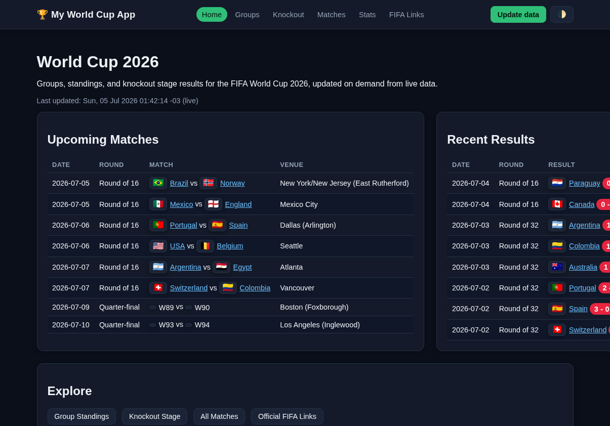
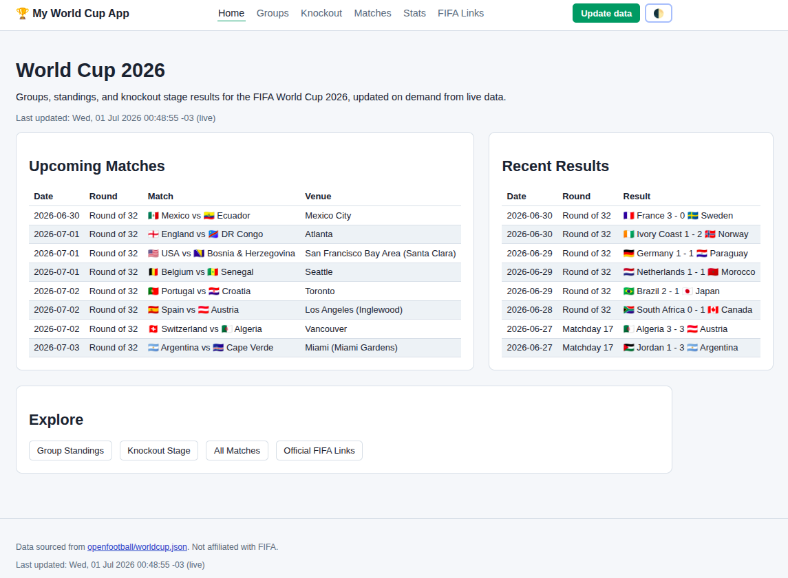
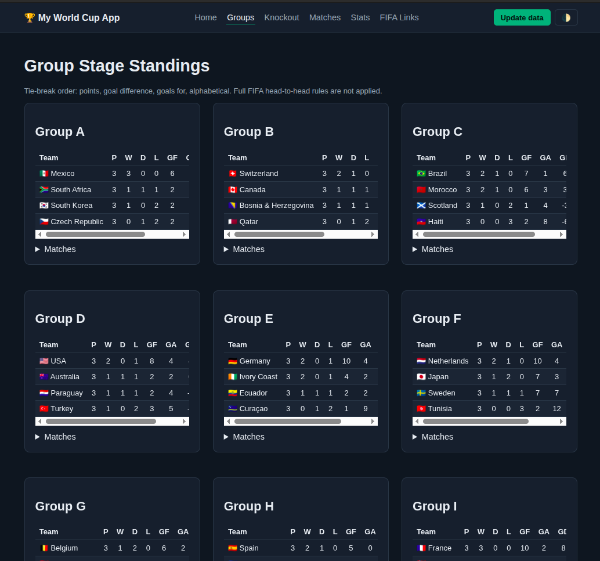
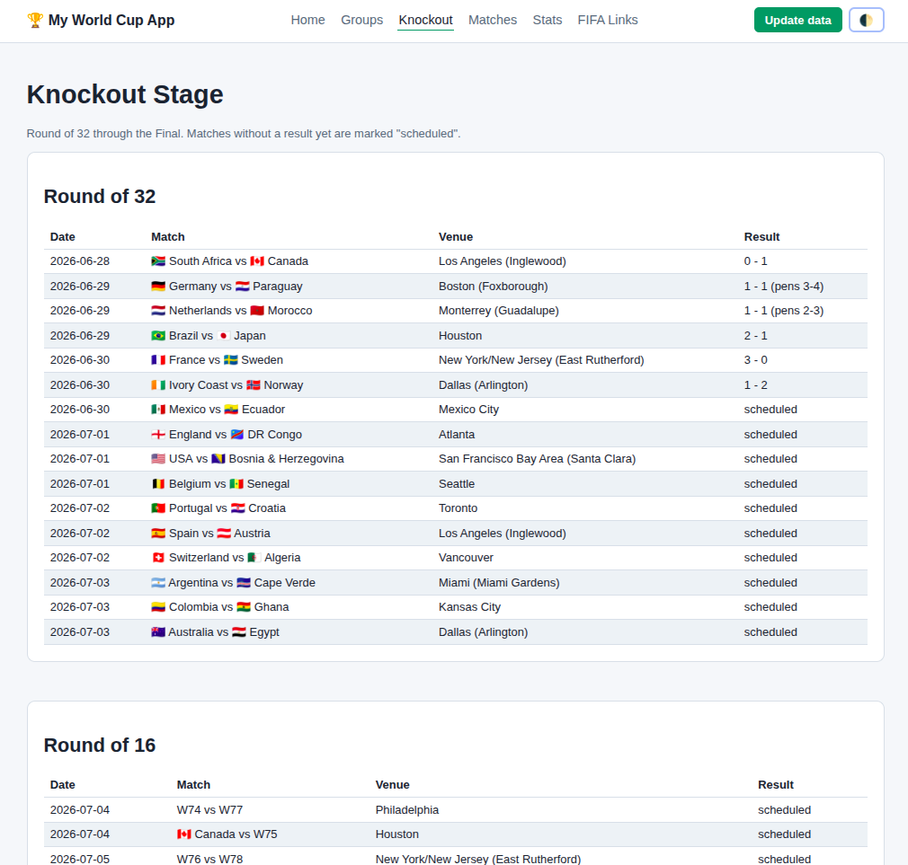
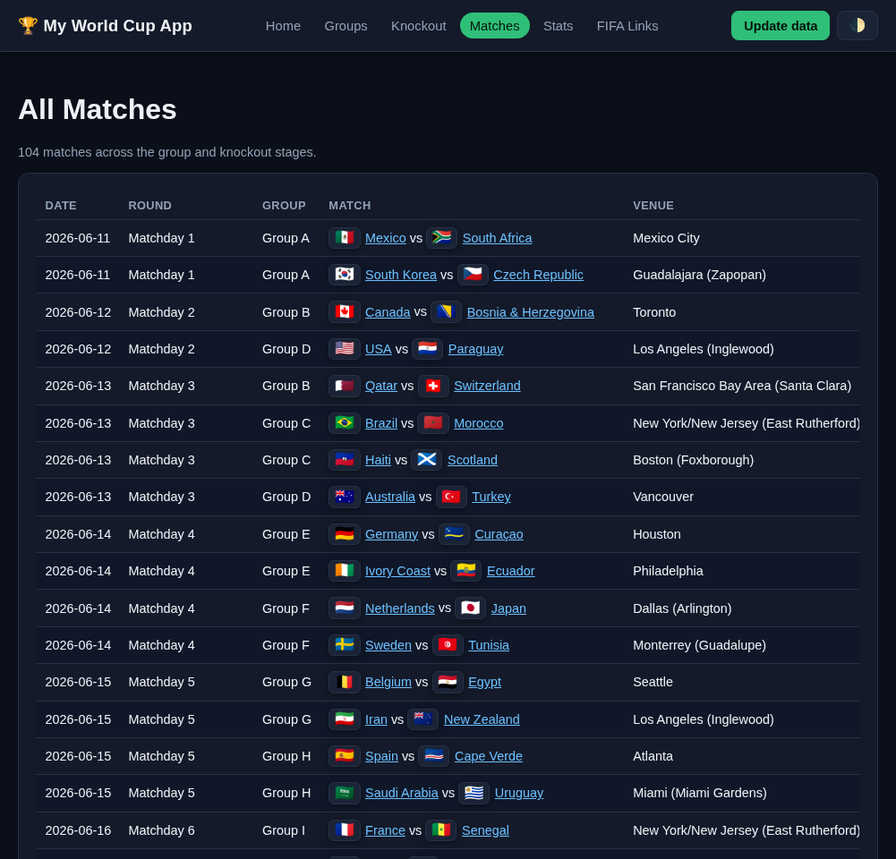
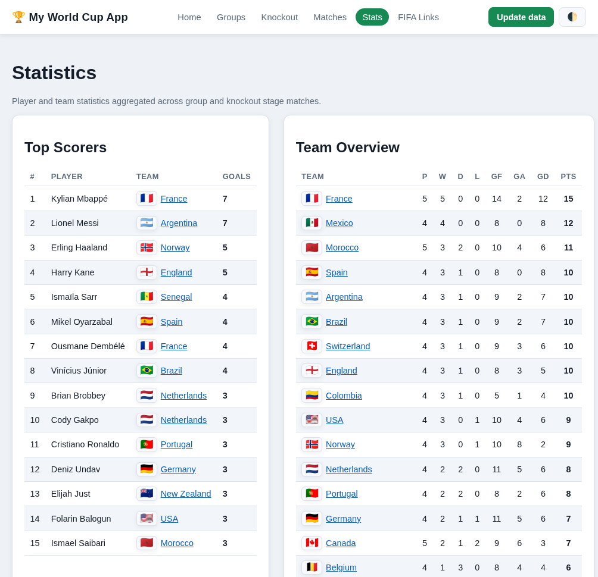
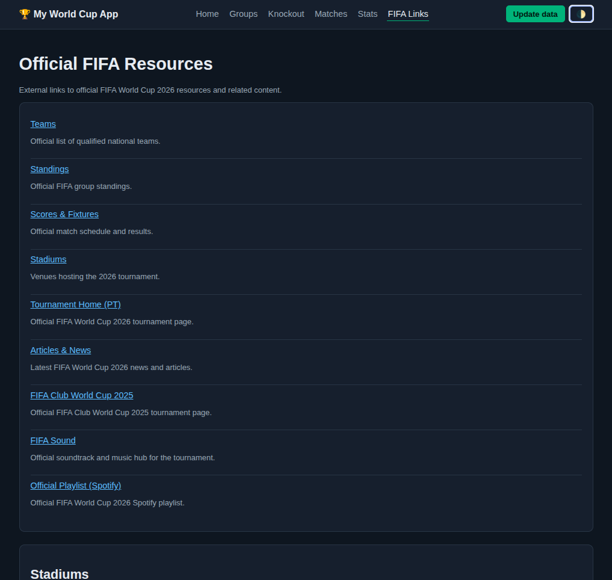
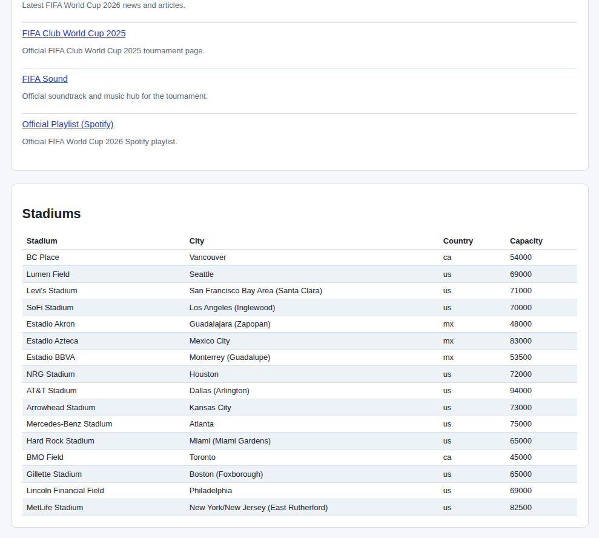
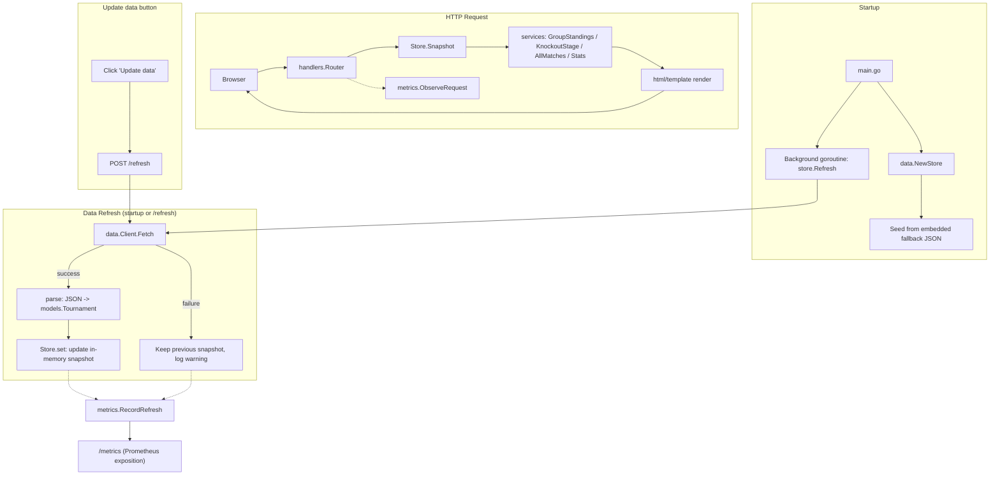

<!-- TOC -->

- [My World Cup App](#my-world-cup-app)
  - [Features](#features)
  - [Screenshots](#screenshots)
  - [Getting Started](#getting-started)
    - [Software Requirements](#software-requirements)
    - [Makefile Targets](#makefile-targets)
    - [Run locally](#run-locally)
    - [Run tests](#run-tests)
    - [Build a binary](#build-a-binary)
    - [Run with Docker](#run-with-docker)
      - [Multi-arch image (linux/amd64 + linux/arm64)](#multi-arch-image-linuxamd64--linuxarm64)
    - [Run with Helm](#run-with-helm)
      - [Deploying to a local kind cluster](#deploying-to-a-local-kind-cluster)
    - [Configuration](#configuration)
  - [Technology Stack](#technology-stack)
  - [Architecture](#architecture)
    - [Data flow](#data-flow)
    - [Request routing](#request-routing)
  - [Directory Structure](#directory-structure)
  - [Data Refresh Behavior](#data-refresh-behavior)
  - [Standings Calculation](#standings-calculation)
  - [Metrics](#metrics)
  - [Testing](#testing)
  - [Contributing](#contributing)
  - [Developer](#developer)
  - [License](#license)

<!-- TOC -->

# My World Cup App

A lightweight Go web application that displays the FIFA World Cup 2026 (Canada/Mexico/USA) group standings, match results, and knockout stage, plus curated links to official FIFA resources. Data is fetched live on startup and on demand, with no database required.

## Features

- **Group standings** — computed on the fly from match results (played, won, drawn, lost, goals, goal difference, points).
- **Knockout stage** — a graphical bracket (Round of 32 through the Final, plus the match for third place) with connector lines and winner highlighting, alongside round-by-round detail tables with date/venue/result.
- **Match list** — every fixture with date, round, group, venue, and result, filterable by round, group, and/or team via query parameters (combinable).
- **Live data refresh** — data is fetched from [openfootball/worldcup.json](https://github.com/openfootball/worldcup.json) on startup and via the "Update data" button; an embedded snapshot is used as a fallback if the live source is unreachable.
- **Statistics** — top scorers and overall team records (played/won/drawn/lost/goals/points) aggregated across group and knockout stage matches.
- **Dark / light theme** — toggle persisted in the browser via `localStorage`.
- **Official FIFA links** — stadiums, teams, standings, articles, scores & fixtures, official match ball, posters, mascots, Club World Cup 2025, and the official FIFA Sound playlist; team names, stadiums, and host cities across the app link to their official fifa.com pages.
- **Observability** — `/healthz` health check and a Prometheus-compatible `/metrics` endpoint (HTTP request counts/latency, data refresh outcomes).

## Screenshots

<table>
  <tr>
    <td align="center" width="50%">
      <a href="images/a.png"></a>
      <br><sub>Home — dark theme</sub>
    </td>
    <td align="center" width="50%">
      <a href="images/b.png"></a>
      <br><sub>Home — light theme</sub>
    </td>
  </tr>
  <tr>
    <td align="center" width="50%">
      <a href="images/c.png"></a>
      <br><sub>Group Standings — dark theme</sub>
    </td>
    <td align="center" width="50%">
      <a href="images/d.png"></a>
      <br><sub>Knockout Stage — light theme</sub>
    </td>
  </tr>
  <tr>
    <td align="center" width="50%">
      <a href="images/e.png"></a>
      <br><sub>All Matches — dark theme</sub>
    </td>
    <td align="center" width="50%">
      <a href="images/f.png"></a>
      <br><sub>Statistics (top scorers &amp; team overview) — light theme</sub>
    </td>
  </tr>
  <tr>
    <td align="center" width="50%">
      <a href="images/g.png"></a>
      <br><sub>Official FIFA Links — dark theme</sub>
    </td>
    <td align="center" width="50%">
      <a href="images/h.png"></a>
      <br><sub>FIFA Links &amp; Stadiums — light theme</sub>
    </td>
  </tr>
</table>

## Getting Started

### Software Requirements

| Tool                                                     | Minimum Version | Required For                          |
|-----------------------------------------------------------|------------------|-----------------------------------------|
| [Go](https://go.dev/doc/install)                           | 1.25             | Building/running/testing locally        |
| [Make](https://www.gnu.org/software/make/)                 | any              | Running the `Makefile` shortcuts        |
| [Git](https://git-scm.com/downloads)                       | any              | Cloning the repository, contributing    |
| [Docker](https://docs.docker.com/get-docker/)               | 24+              | Building/running the container image    |
| [Docker Compose](https://docs.docker.com/compose/install/) | v2 (plugin)      | Local containerized run (`docker compose`) |
| [Docker Buildx](https://docs.docker.com/build/architecture/#buildx) | v0.10+   | Multi-arch image builds/push (`make docker-build-multiarch`, `make docker-push`) — bundled with Docker Desktop and recent Docker Engine installs |
| [Helm](https://helm.sh/docs/intro/install/)                 | 3.x              | Installing/linting the Helm chart       |
| [helm-docs](https://github.com/norwoodj/helm-docs#installation) | 1.x        | Regenerating `helm/my-world-cup-app/README.md` |
| [kind](https://kind.sigs.k8s.io/docs/user/quick-start/#installation) | v0.20+  | Loading the local image into a local kind cluster (`make kind-load`) |

Run `make check-deps` to verify which of these are installed on your machine; it prints installation instructions for anything missing.

See also [CONTRIBUTING.md](CONTRIBUTING.md) for the contribution workflow.

### Makefile Targets

Run `make help` (or just `make`, since `help` is the default goal) to print this list from the terminal.

| Target                | Description                                                                  |
|------------------------|--------------------------------------------------------------------------------|
| `make help`            | Show the list of available targets                                           |
| `make check-deps`      | Verify required development/runtime tools are installed                      |
| `make run`             | Run the application locally                                                  |
| `make build`           | Build the server binary into `bin/`                                          |
| `make test`            | Run all tests                                                                |
| `make test-coverage`   | Run tests with a coverage report                                             |
| `make fmt`             | Format source code                                                           |
| `make fmt-check`       | Check source code formatting                                                 |
| `make vet`             | Run `go vet`                                                                 |
| `make tidy`            | Tidy `go.mod`/`go.sum`                                                       |
| `make check`           | Run formatting, vet, and tests (`fmt-check` + `vet` + `test`)                |
| `make docker-build`    | Build the Docker image (tagged with the `VERSION` file's version)            |
| `make docker-up`       | Start the application via Docker Compose                                     |
| `make docker-down`     | Stop and remove the Docker Compose services                                  |
| `make docker-logs`     | Tail the application container logs                                          |
| `make docker-buildx-setup` | Create (or reuse) the Docker Buildx builder used for multi-arch images   |
| `make docker-build-multiarch` | Build a multi-arch image (linux/amd64 + linux/arm64, runs on Linux and macOS/Intel+Apple Silicon) without pushing, to validate the build for both platforms |
| `make docker-push`     | Build and push a multi-arch image (linux/amd64 + linux/arm64); interactively prompts for registry username, password/token, and repository name |
| `make kind-load`       | Load the local Docker image into the kind cluster (`KIND_CLUSTER`, default `kind-multinodes`) |
| `make helm-sync-version` | Write the `VERSION` file's version into the Helm chart's `appVersion` (`helm/my-world-cup-app/Chart.yaml`) |
| `make helm-lint`       | Lint the Helm chart                                                          |
| `make helm-docs`       | Sync `appVersion` from `VERSION`, then regenerate the Helm chart README (`helm/*/README.md`) via helm-docs |
| `make helm-install`    | Install/upgrade the app into Kubernetes via Helm (namespace: `NAMESPACE`, default app name) |
| `make helm-uninstall`  | Uninstall the Helm release from Kubernetes                                   |
| `make clean`           | Remove build artifacts                                                       |

### Run locally

```bash
make run
# or
PORT=8080 go -C app run ./cmd/server
```

Then open http://localhost:8080.

### Run tests

```bash
make test              # go test ./... -v
make test-coverage     # with coverage report
```

### Build a binary

```bash
make build              # outputs bin/my-world-cup-app
```

### Run with Docker

```bash
make docker-build       # docker compose build
make docker-up          # docker compose up -d --build
make docker-logs        # tail logs
make docker-down        # stop and remove
```

The container serves the app on `PORT` (default `8080`), mapped to the host via `docker-compose.yml`.

#### Multi-arch image (linux/amd64 + linux/arm64)

`Dockerfile` builds a static, CGO-free binary, so the same build works unmodified on both `linux/amd64` and `linux/arm64` — covering Linux servers and macOS (both Intel and Apple Silicon, since Docker Desktop always runs Linux containers matching the host architecture) via [Docker Buildx](https://docs.docker.com/build/architecture/#buildx):

```bash
make docker-build-multiarch    # build for linux/amd64 + linux/arm64 (validates only; multi-platform results can't be loaded into the local daemon)
make docker-push               # build + push a multi-arch manifest to a registry
```

`make docker-push` interactively prompts for:

1. **Docker registry username**
2. **Docker registry password or access token** (hidden input, piped to `docker login --password-stdin` — never passed as a CLI argument or left in shell history)
3. **Repository name**, e.g. `docker.io/<user>/my-world-cup-app` or `ghcr.io/<user>/my-world-cup-app` (the registry host is inferred from this to log in against the right registry; omit a host to default to Docker Hub)
4. **Image tag** (defaults to the version in the root [`VERSION`](VERSION) file if left blank)

`make docker-push` also runs `make helm-sync-version` first, so `helm/my-world-cup-app/Chart.yaml`'s `appVersion` always matches the `VERSION` file before an image is published. Override the target platform list with `DOCKER_PLATFORMS` (default `linux/amd64,linux/arm64`), e.g. `make docker-push DOCKER_PLATFORMS=linux/amd64`.

Every image is also labeled `org.opencontainers.image.version` with the tag actually used (`docker inspect <image> --format '{{.Config.Labels}}'` to check), baked in via the Dockerfile's `APP_VERSION` build-arg.

### Run with Helm

A Helm chart is provided at `helm/my-world-cup-app` for Kubernetes deployment:

```bash
helm lint helm/my-world-cup-app
helm template my-world-cup-app helm/my-world-cup-app   # render manifests locally
helm install my-world-cup-app helm/my-world-cup-app --set image.repository=<your-registry>/my-world-cup-app --set image.tag=<tag>
```

The chart deploys a single `Deployment` + `Service` (ClusterIP by default), wires `/healthz` as the liveness/readiness probe, and pre-populates `prometheus.io/scrape`, `prometheus.io/port`, and `prometheus.io/path` pod annotations so a cluster Prometheus can auto-discover `/metrics`. Ingress and HPA are included but disabled by default (`ingress.enabled` / `autoscaling.enabled` in `values.yaml`).

#### Deploying to a local kind cluster

Since a local kind cluster can't pull an image that only exists in your local Docker daemon, load it in first:

```bash
make kind-load                 # docker-build, then `kind load docker-image` into KIND_CLUSTER (default kind-multinodes)
make helm-install               # installs/upgrades using the image tagged with the VERSION file's version
```

Override the target cluster with `make kind-load KIND_CLUSTER=<cluster-name>` if yours isn't named `kind-multinodes`.

### Configuration

All configuration is via environment variables (see `app/internal/config/config.go`). There are no required variables — every one of them has a working default.

| Variable                | Default                                            | Description                |
|--------------------------|-----------------------------------------------------|------------------------------|
| `PORT`                   | `8080`                                              | HTTP listen port            |
| `WORLDCUP_MATCHES_URL`   | openfootball `2026/worldcup.json`                   | Match data source            |
| `WORLDCUP_GROUPS_URL`    | openfootball `2026/worldcup.groups.json`            | Group assignments source     |
| `WORLDCUP_TEAMS_URL`     | openfootball `2026/worldcup.teams.json`             | Team metadata source          |
| `WORLDCUP_STADIUMS_URL`  | openfootball `2026/worldcup.stadiums.json`          | Stadium data source           |

## Technology Stack

- [Go](https://go.dev/) 1.25 — standard library for the web layer (`net/http`, `html/template`, `encoding/json`, `embed`); no web framework.
- [prometheus/client_golang](https://github.com/prometheus/client_golang) — the only third-party dependency, used solely for `/metrics` instrumentation (`app/internal/metrics`).
- Vanilla CSS (custom properties for theming) and vanilla JavaScript (no build step, no client framework).
- Docker / Docker Compose for containerized runs; a Helm chart for Kubernetes deployment.
- `go test` for unit and integration tests.

## Architecture

The application follows a clean, layered architecture:

```
app/cmd/server        entrypoint: wiring, HTTP server lifecycle
app/internal/config    environment-driven configuration
app/internal/models    domain types (Team, Group, Match, Stadium, Standing, Tournament)
app/internal/data      HTTP client, JSON parsing/normalization, thread-safe in-memory store
app/internal/services  business logic: group standings, knockout grouping, match/stats queries
app/internal/handlers  HTTP handlers, routing, template rendering
app/internal/metrics   Prometheus instrumentation (HTTP requests, data refresh outcomes)
app/web/               embedded HTML templates and static assets (CSS/JS)
helm/                   Helm chart for Kubernetes deployment
```

- **Handlers** depend on **services** and the **data store**, never the other way around.
- **Services** are pure functions operating on **models**, independent of HTTP or the data source — easy to unit test.
- **Data** owns fetching, parsing, and caching; it exposes a `Store` with `Snapshot()` and `Refresh()`.
- No database: the `Store` holds the current `Tournament` in memory behind a `sync.RWMutex`. Standings are recomputed from match results on every request rather than persisted.

### Data flow



### Request routing

| Method | Path        | Handler              | Description                          |
|--------|-------------|-----------------------|---------------------------------------|
| GET    | `/`         | `pages.Home`          | Dashboard: upcoming/recent matches    |
| GET    | `/groups`   | `pages.Groups`        | Group standings and results           |
| GET    | `/knockout` | `pages.Knockout`      | Knockout stage bracket + round detail |
| GET    | `/matches`  | `pages.Matches`       | Match list, filterable by `round`/`group`/`team` query params |
| GET    | `/stats`    | `pages.Stats`         | Top scorers and team statistics       |
| GET    | `/links`    | `pages.Links`         | Official FIFA/Spotify links, stadiums |
| POST   | `/refresh`  | `refresh.Refresh`     | Triggers a live data refresh          |
| GET    | `/healthz`  | `healthz`             | Health check (used by Docker/Helm)    |
| GET    | `/metrics`  | Prometheus handler    | Prometheus metrics exposition         |
| GET    | `/static/*` | embedded file server  | CSS/JS assets                         |

## Directory Structure

```
my-world-cup-app/
├── app/                          # Go module root — all application source
│   ├── cmd/server/main.go
│   ├── internal/
│   │   ├── config/
│   │   ├── models/
│   │   ├── data/
│   │   │   ├── client.go
│   │   │   ├── fallback.go
│   │   │   ├── fallback/        # embedded snapshot JSON (openfootball 2026 data)
│   │   │   ├── parser.go
│   │   │   └── store.go
│   │   ├── services/            # standings, knockout, matches, stats
│   │   ├── handlers/
│   │   └── metrics/              # Prometheus counters/histograms
│   ├── web/
│   │   ├── assets.go            # go:embed directives
│   │   ├── templates/
│   │   └── static/{css,js}/
│   ├── go.mod
│   └── go.sum
├── helm/my-world-cup-app/      # Helm chart
├── Dockerfile
├── docker-compose.yml
├── Makefile
├── VERSION                       # release version; see make helm-sync-version / docker-push
├── README.md
├── CHANGELOG.md
├── CONTRIBUTING.md
└── CLAUDE.md
```

## Data Refresh Behavior

1. On startup, the app seeds itself from an **embedded snapshot** of the four openfootball JSON files (bundled at build time via `go:embed`), so it can serve pages immediately.
2. A background goroutine performs an initial **live refresh** against the configured URLs.
3. Clicking **"Update data"** in the UI (or `POST /refresh`) triggers a synchronous live refresh.
4. If a live fetch fails (network issue, rate limit, etc.), the previous snapshot is kept and the failure is logged — the app never serves a broken or empty page.

## Standings Calculation

Group tables (and the overall team statistics on `/stats`) are computed from played matches using standard football scoring (3 points for a win, 1 for a draw). Ties are broken by: points → goal difference → goals for → alphabetical order. This is a simplified tie-break; it does not implement FIFA's full head-to-head/fair-play rules.

## Metrics

`/metrics` exposes a dedicated Prometheus registry (`app/internal/metrics`), not the global default one:

- `http_requests_total{method,path,status}` — request counts, `status` bucketed as `2xx`/`3xx`/`4xx`/`5xx`.
- `http_request_duration_seconds{method,path}` — request latency histogram.
- `data_refresh_total{outcome}` — count of refresh attempts, `outcome` = `success`/`failure`.
- `data_last_refresh_timestamp_seconds` — Unix timestamp of the last successful refresh.

## Testing

- `app/internal/data`: JSON parsing/normalization tests, plus store tests covering successful refresh, failed refresh (previous snapshot retained), and fallback seeding.
- `app/internal/services`: standings, knockout grouping, top-scorer, and team-statistics computation tests with known inputs/expected outputs.
- `app/internal/handlers`: HTTP integration tests (`httptest`) covering every route (including `/stats` and `/metrics`), static asset serving, and refresh failure handling.

## Contributing

See [CONTRIBUTING.md](CONTRIBUTING.md) for the fork/branch/PR workflow and recommended editor setup.

## Developer

Aecio dos Santos Pires

- Linkedin: https://www.linkedin.com/in/aeciopires/
- Site: http://aeciopires.com/

## License

See [LICENSE](LICENSE).
